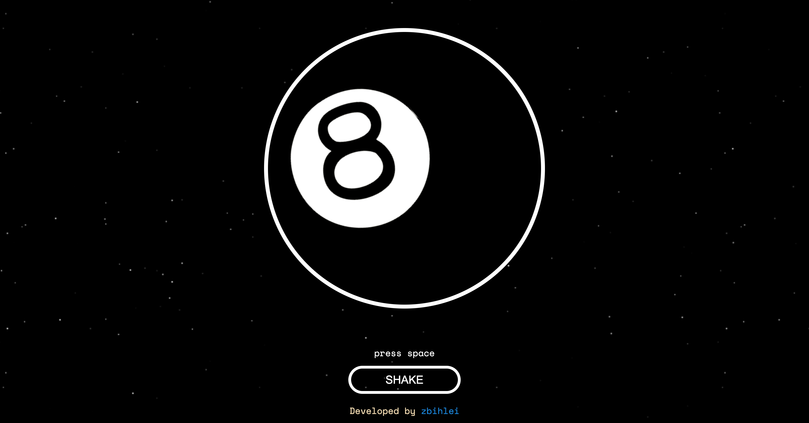
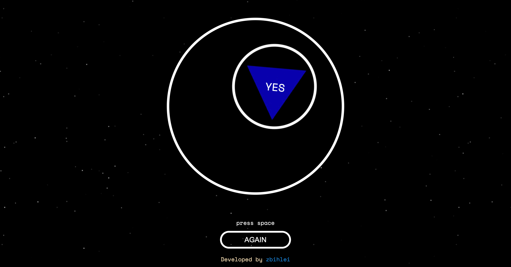

# Project Name

Magic 8 Ball

## Table of Contents

1. [Requirements](#requirements)
2. [Installation](#installation)
3. [Links](#links)
4. [Screenshots](#screenshots)


## Requirements

List of requirements to run the project, for example:
- Node.js
- React.js

## Installation

1. Clone the repository to your local machine:

    ```bash
    git clone https://github.com/zbihlei/magic8ball.git
    ```

2. Navigate to the project directory:

    ```bash
    cd yourproject
    ```

3. Install dependencies:

    ```bash
    npm install
    ```

4. Run dev mode:

    ```bash
    npm run dev
    ```

## Links

Links to additional resources such as design mockups, documentation, etc.

- [Project deploy](https://magic8ball-kappa.vercel.app/)

## Screenshots



